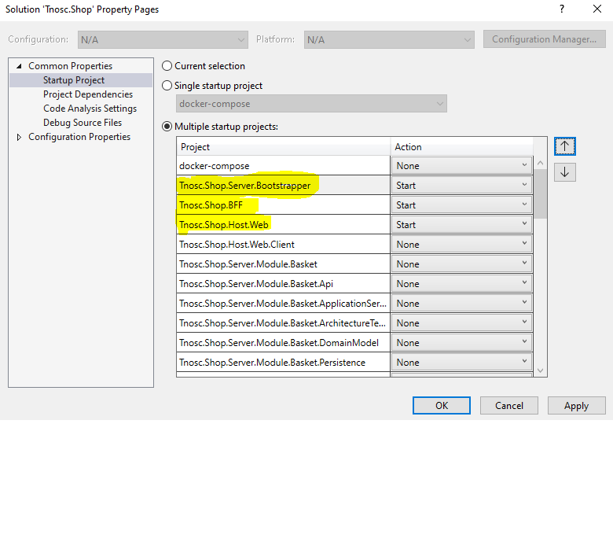
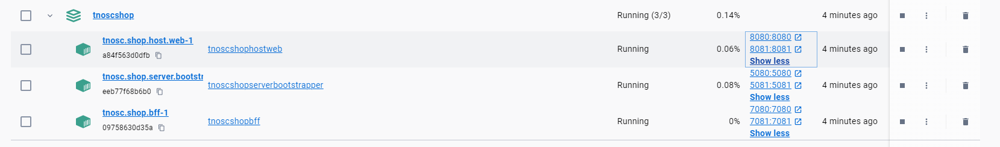

# Shop Reference Application

A reference .NET application implementing an eCommerce web site using a **modular architecture**.


## Goals
 By adopting a modular approach, we aim to create a flexible and scalable application that can easily adapt to evolving requirements. 
 
 Additionally, this project serves as a platform for learning and implementing advanced concepts in software development such as CQRS, DDD, Clean architecture and so on.


## Getting Started

### Prerequisites

- Install the latest [.NET 8 SDK](https://github.com/dotnet/installer#installers-and-binaries)
- (Windows only) Install Visual Studio. [Visual Studio 2022 version 17.10 Preview](https://visualstudio.microsoft.com/vs/preview/).
- Install & start Docker Desktop:  https://docs.docker.com/engine/install/
- Clone the Shop repository: https://github.com/TNOSC/shop

### Running the solution

* (Windows only) Run the application from Visual Studio:
 - Open the `Tnosc.Shop.sln` file in Visual Studio
 - Ensure that `Tnosc.Shop.Host.Web.csproj` and `Tnosc.Shop.Server.Bootstrapper.csproj`  are your startup projects
	
	
 - Hit Ctrl-F5 to launch the application 

* Or run the application from your terminal using docker:
```powershell
dotnet dev-certs https -ep "$env:APPDATA\ASP.NET\Https\tnoscshop.pfx" -p tnosc --trust
docker-compose up
```


### Shared Libraries

This project uses shared libraries encapsulated as Nuget packages https://www.nuget.org/profiles/TNOSC to promote code reusability and maintainability.

For more information about these shared libraries, please check this link https://tnosc.gitbook.io/tnosc.

## Documentation

The documentation for this project follows the [arc42 template](https://arc42.org/overview), which is a standardized approach for documenting software and system architecture. 

The PDF output of the documentation is located [here](./docs/build/pdf/arc42/arc42.pdf).

## Technologies & Libraries

- Microsoft Fluent UI Blazor components
- Minimal APIs
- Swagger & Swagger UI
- MediatR
- FluentValidation
- Entity Framework Core
- xUnit
- ArchUnitNET
- ...

## License
This project is licensed with the [MIT license](./LICENSE.txt) .

## Contributing

For more information on contributing to this repo, please read [the contribution documentation](./CONTRIBUTING.md) and [the Code of Conduct](CODE-OF-CONDUCT.md).

## Inspirations and Recommendations

 Below you'll find a list of repositories and YouTube channels that were instrumental in developing this application. These resources provided valuable insights, tutorials, and code examples that contributed to the creation of our project.

### Repositories
- [modular-framework](https://github.com/devmentors/modular-framework) : Set of shared abstractions & components for building the modular monolith.
- [DomainDrivenDesignUniversity](https://github.com/dr-marek-jaskula/DomainDrivenDesignUniversity) : This project was made for tutorial purpose - to clearly present the domain driven design concept.
- [eShop](https://github.com/dotnet/eShop) : A reference .NET application implementing an eCommerce site.

### YouTube Channels
- [Devmentors](https://www.youtube.com/@DevMentorsEN)
- [Nick Chapsas](https://www.youtube.com/@nickchapsas)
- [Milan Jovanovic](https://www.youtube.com/@MilanJovanovicTech)
